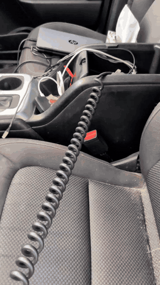

# Radio Electronics Interface Lab

A private supporting repo for radio interfaces, cable work, SDR/RF, and electronics bench evidence.

## Purpose

This repo provides brief, separated synopses for the physical/electrical layer that supports the radio and TAK repos: connectors, soldering, SDR/RF work, and embedded electronics inspection.

## Evidence Structure

### Cables and Interfaces

Connector parts, soldering, and closeups support hands-on interface fabrication and inspection.

Selected vehicle-radio interface video evidence adds motion context for cable routing and radio interface handling in a vehicle environment.

Selected still evidence below adds custom connector and keyfill/interface cable context.

 

 

### UHF Manpack Development

Selected still evidence below documents a UHF/EFJohnson manpack development path: a plastic 3D-printed frame, side support geometry, a panel concept for antenna mounting and power-switch access, and fitment of the radio package into an Osprey backpack-style carry setup.

 

 

 

 

 

### RF and SDR

HackRF/spectrum and aviation-tracking evidence provide RF context without overclaiming formal test-lab coverage.

### Embedded Electronics

PCB inspection, breadboard work, and teardown photos show electronics fluency relevant to systems integration.

## Current Evidence

- Active media assets: 46
- JPG stills: 44
- Animated GIFs: 2
- Source posture: private review assets only; publication requires redaction and fit review.

## Review Docs

- [Evidence gallery](docs/evidence-gallery.md)
- [Evidence manifest](evidence-manifest.md)
- [Sanitization notes](docs/sanitization-notes.md)
