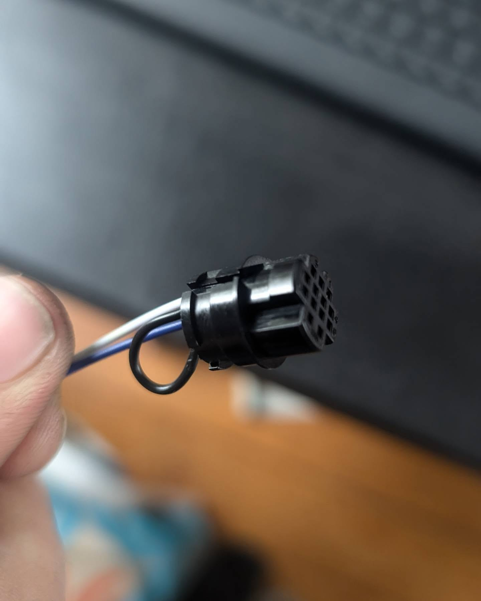
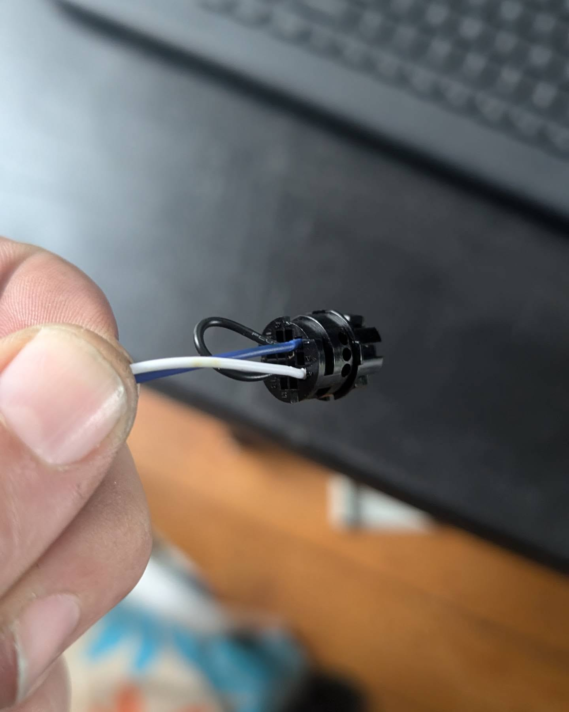
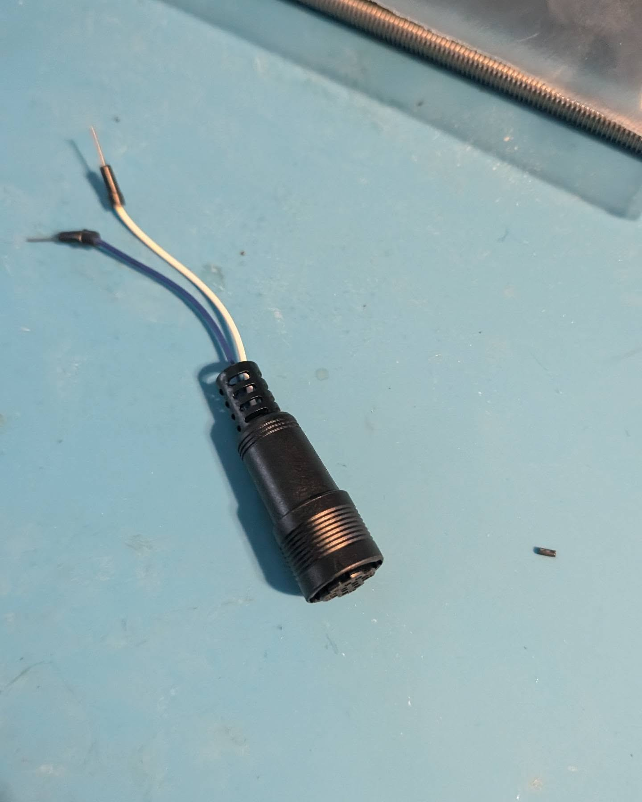
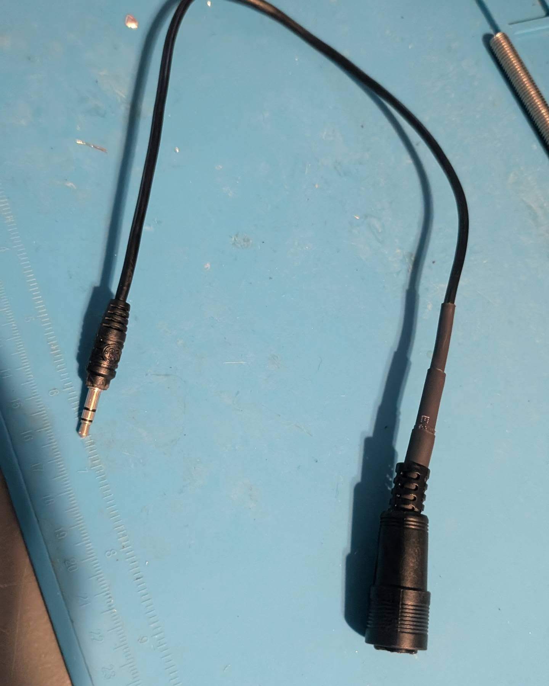
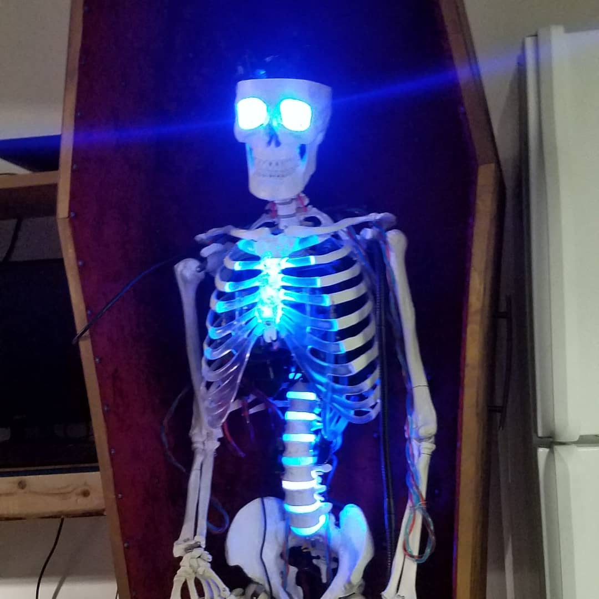
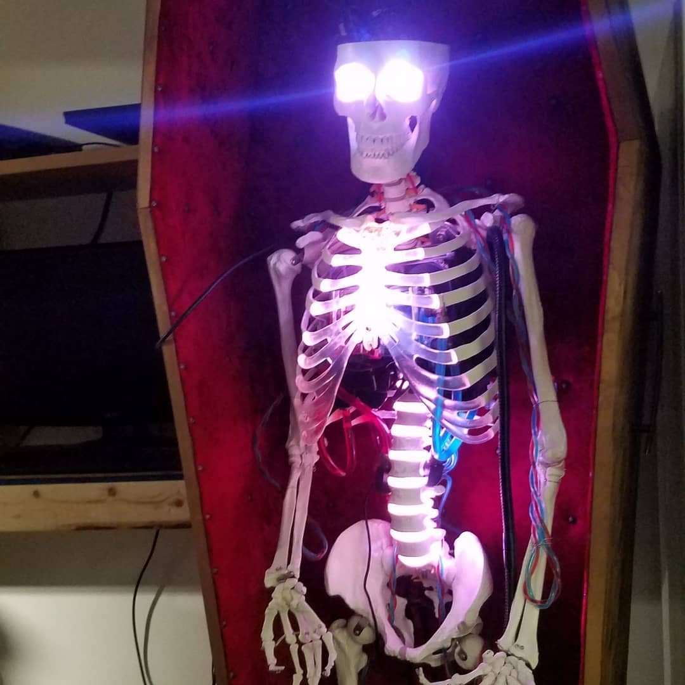
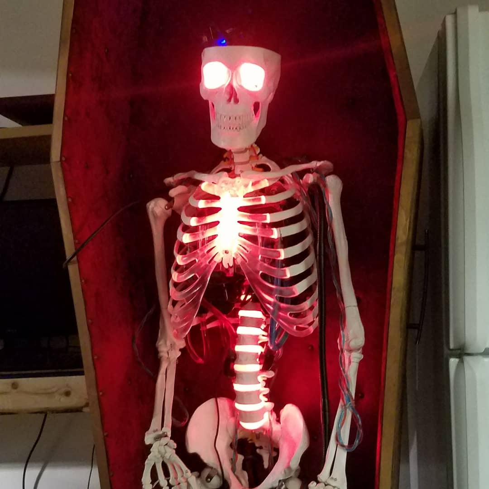

# Evidence Gallery: Radio Electronics Interface Lab

Private review gallery. Images are shown two-wide where GitHub Markdown allows.

## Cables / Connectors / Interfaces

### Connector Parts

- Date: `2024-09-13`
- Source repo: `tactical-radio-systems-lab`
- Review note: Physical interface work: sourcing, soldering, inspection, and closeups.

### Connector Parts

- Date: `2024-09-13`
- Source repo: `tactical-radio-systems-lab`
- Review note: Physical interface work: sourcing, soldering, inspection, and closeups.

### Connector Parts

- Date: `2024-09-13`
- Source repo: `tactical-radio-systems-lab`
- Review note: Physical interface work: sourcing, soldering, inspection, and closeups.

### Connector Parts

- Date: `2024-09-13`
- Source repo: `tactical-radio-systems-lab`
- Review note: Physical interface work: sourcing, soldering, inspection, and closeups.

### Connector Soldering

- Date: `2024-09-14`
- Source repo: `tactical-radio-systems-lab`
- Review note: Physical interface work: sourcing, soldering, inspection, and closeups.

### Connector Soldering

- Date: `2024-09-14`
- Source repo: `tactical-radio-systems-lab`
- Review note: Physical interface work: sourcing, soldering, inspection, and closeups.

### Connector Soldering

- Date: `2024-09-14`
- Source repo: `tactical-radio-systems-lab`
- Review note: Physical interface work: sourcing, soldering, inspection, and closeups.

### Connector Soldering

- Date: `2024-09-14`
- Source repo: `tactical-radio-systems-lab`
- Review note: Physical interface work: sourcing, soldering, inspection, and closeups.

### Connector Soldering

- Date: `2024-09-14`
- Source repo: `tactical-radio-systems-lab`
- Review note: Physical interface work: sourcing, soldering, inspection, and closeups.

### Connector Closeup

- Date: `2024-09-24`
- Source repo: `tactical-radio-systems-lab`
- Review note: Physical interface work: sourcing, soldering, inspection, and closeups.

### Connector Closeup

- Date: `2024-09-24`
- Source repo: `tactical-radio-systems-lab`
- Review note: Physical interface work: sourcing, soldering, inspection, and closeups.

### Connector Closeup

- Date: `2024-09-24`
- Source repo: `tactical-radio-systems-lab`
- Review note: Physical interface work: sourcing, soldering, inspection, and closeups.

### Connector Closeup

- Date: `2024-09-24`
- Source repo: `tactical-radio-systems-lab`
- Review note: Physical interface work: sourcing, soldering, inspection, and closeups.

### Connector Closeup

- Date: `2024-09-24`
- Source repo: `tactical-radio-systems-lab`
- Review note: Physical interface work: sourcing, soldering, inspection, and closeups.

## SDR / RF / Aviation Signals

### Aviation Tracking

- Date: `2025-06-16`
- Source repo: `rf-sdr-test-lab`
- Review note: RF/spectrum and aviation-tracking support evidence.

### Faa Part 107 Study

- Date: `2023-08-16`
- Source repo: `rf-sdr-test-lab`
- Review note: RF/spectrum and aviation-tracking support evidence.

### Hackrf Portable Battery

- Date: `2024-09-02`
- Source repo: `rf-sdr-test-lab`
- Review note: RF/spectrum and aviation-tracking support evidence.

### Hackrf Portable Battery

- Date: `2024-09-02`
- Source repo: `rf-sdr-test-lab`
- Review note: RF/spectrum and aviation-tracking support evidence.

### Hackrf Sweep Mavic Air 2

- Date: `2024-09-14`
- Source repo: `rf-sdr-test-lab`
- Review note: RF/spectrum and aviation-tracking support evidence.

### Hackrf Sweep Mavic Air 2

- Date: `2024-09-14`
- Source repo: `rf-sdr-test-lab`
- Review note: RF/spectrum and aviation-tracking support evidence.

### Mavic Air 2 5Ghz Spectrum

- Date: `2024-09-15`
- Source repo: `rf-sdr-test-lab`
- Review note: RF/spectrum and aviation-tracking support evidence.

## Embedded Electronics / PCB Inspection

### Arduino Breadboard Electronics Notes

- Date: `2022-10-16`
- Source repo: `embedded-electronics-integration`
- Review note: Bench electronics, PCB inspection, teardown, and wiring support evidence.

### Arduino Breadboard Electronics Notes

- Date: `2022-10-16`
- Source repo: `embedded-electronics-integration`
- Review note: Bench electronics, PCB inspection, teardown, and wiring support evidence.

### Blue Mat Bench Wiring

- Date: `2024-09-03`
- Source repo: `embedded-electronics-integration`
- Review note: Bench electronics, PCB inspection, teardown, and wiring support evidence.

### Handheld Radio Scanner Security Device On Table

- Date: `2024-04-07`
- Source repo: `embedded-electronics-integration`
- Review note: Bench electronics, PCB inspection, teardown, and wiring support evidence.

### Led Skeleton Display

- Date: `2018-03-21`
- Source repo: `embedded-electronics-integration`
- Review note: Bench electronics, PCB inspection, teardown, and wiring support evidence.

### Led Skeleton Display

- Date: `2018-03-21`
- Source repo: `embedded-electronics-integration`
- Review note: Bench electronics, PCB inspection, teardown, and wiring support evidence.

### Led Skeleton Display

- Date: `2018-03-21`
- Source repo: `embedded-electronics-integration`
- Review note: Bench electronics, PCB inspection, teardown, and wiring support evidence.

### Microscope Pcb Electronics Inspection Setup

- Date: `2022-10-30`
- Source repo: `embedded-electronics-integration`
- Review note: Bench electronics, PCB inspection, teardown, and wiring support evidence.

### Microscope Pcb Electronics Inspection Setup

- Date: `2022-10-30`
- Source repo: `embedded-electronics-integration`
- Review note: Bench electronics, PCB inspection, teardown, and wiring support evidence.

### Phone Pcb Teardown And Power Wiring Sequence

- Date: `2022-01-22`
- Source repo: `embedded-electronics-integration`
- Review note: Bench electronics, PCB inspection, teardown, and wiring support evidence.

### Phone Pcb Teardown And Power Wiring Sequence

- Date: `2022-01-22`
- Source repo: `embedded-electronics-integration`
- Review note: Bench electronics, PCB inspection, teardown, and wiring support evidence.

### Phone Pcb Teardown And Power Wiring Sequence

- Date: `2022-01-22`
- Source repo: `embedded-electronics-integration`
- Review note: Bench electronics, PCB inspection, teardown, and wiring support evidence.

### Phone Pcb Teardown And Power Wiring Sequence

- Date: `2022-01-22`
- Source repo: `embedded-electronics-integration`
- Review note: Bench electronics, PCB inspection, teardown, and wiring support evidence.

### Phone Pcb Teardown And Power Wiring Sequence

- Date: `2022-01-22`
- Source repo: `embedded-electronics-integration`
- Review note: Bench electronics, PCB inspection, teardown, and wiring support evidence.
