# Evidence Gallery

Public-safe gallery derived from a private source archive.

Media rule: still evidence is stored as JPG; verified video evidence is stored as animated GIF.

## Microscope Pcb Electronics Inspection Setup

- Source: Private source archive; public-safe derivative

 

## Arduino Breadboard Electronics Notes

- Source: Private source archive; public-safe derivative

 

## Phone Pcb Teardown And Power Wiring Sequence

- Source: Private source archive; public-safe derivative

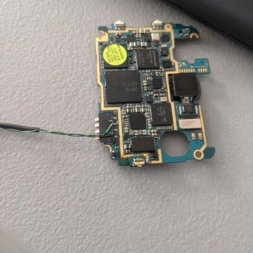 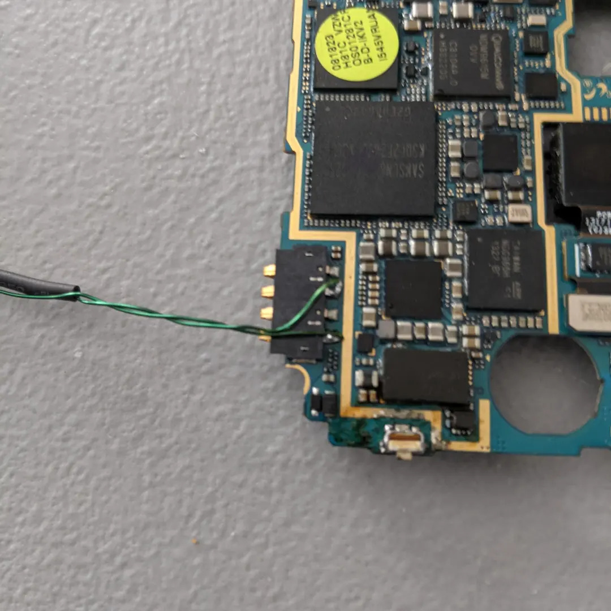

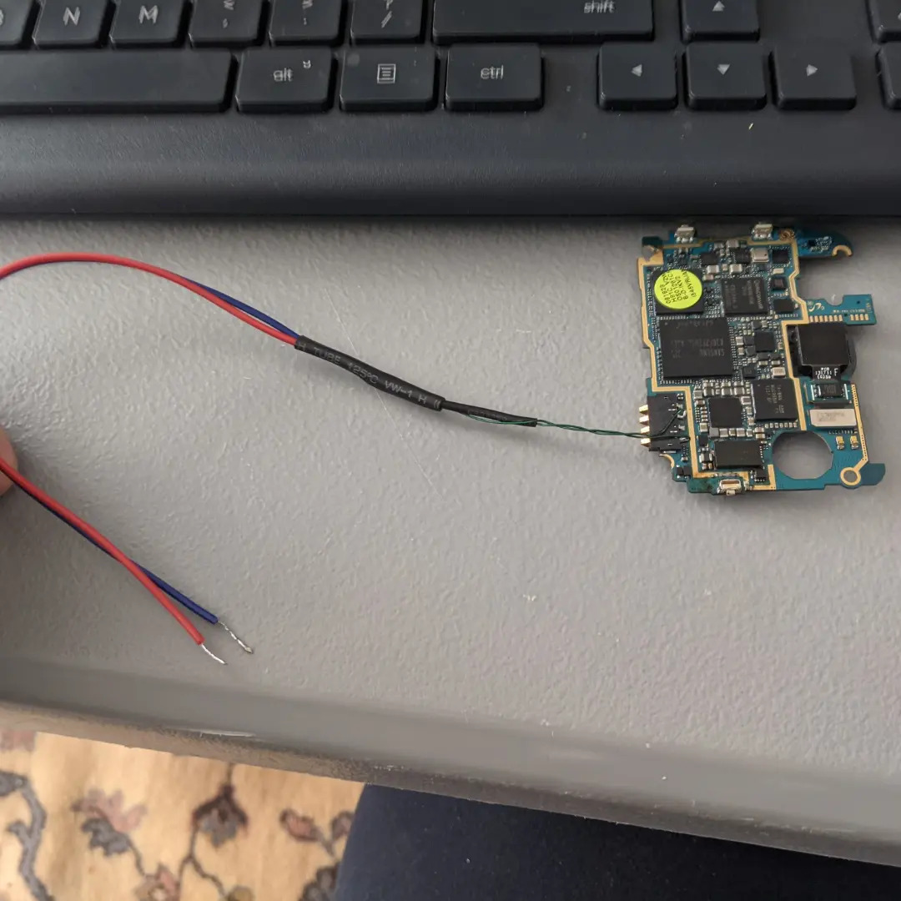 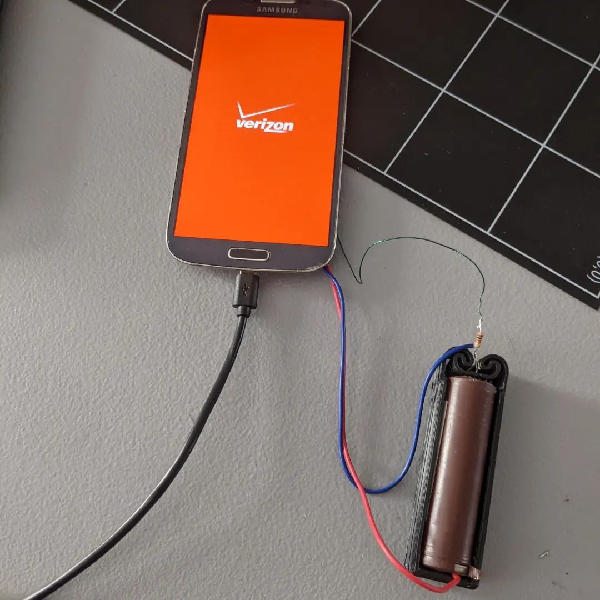

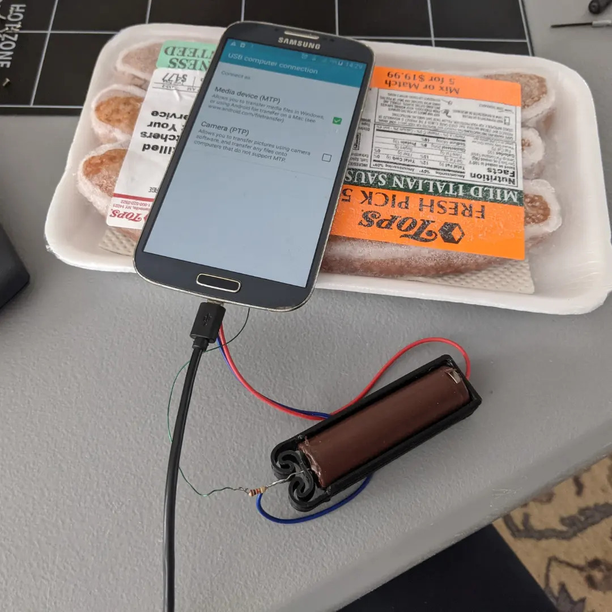

## Handheld Radio Scanner Security Device On Table

- Source: Private source archive; public-safe derivative

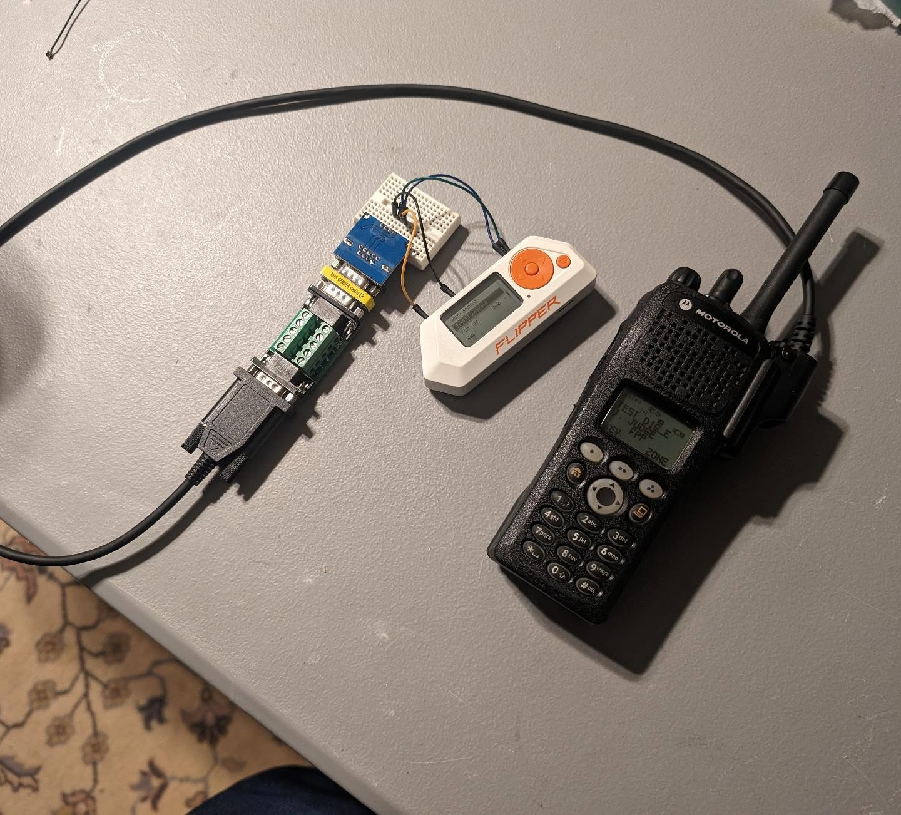

## Aviation Tracking

- Source: Private source archive; public-safe derivative

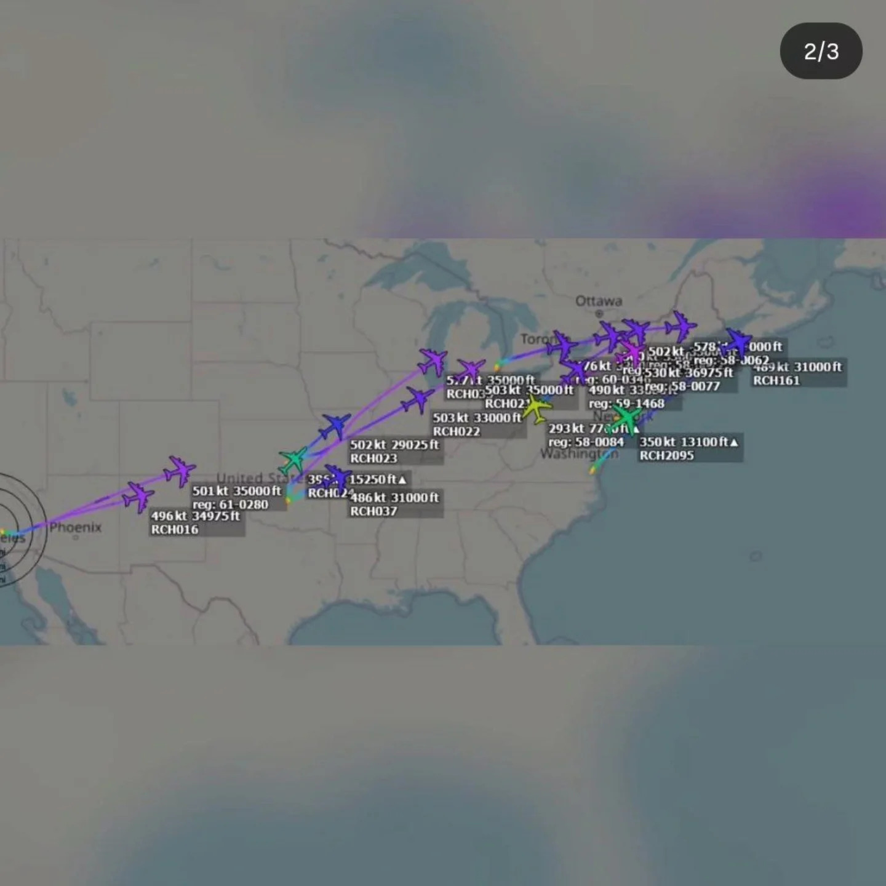

## GNU Radio Audio Filtering And Baseband Monitor Work

- Source: Private source archive; cropped public-safe derivative.
- Notes: GNU Radio Companion flowgraph and related baseband monitor screenshots showing audio-source signal processing with band-pass filtering, low-frequency hum rejection, RMS measurement, spectrum visualization, and audio output.

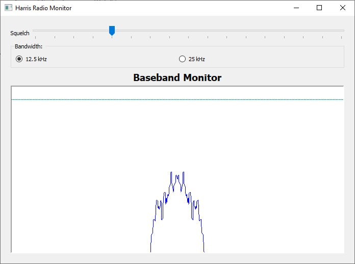 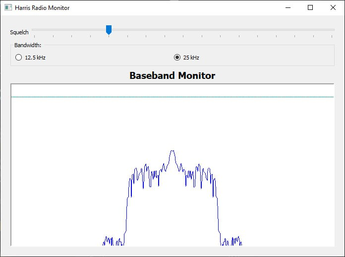

## Pole-Mounted VHF/UHF Dipole Antenna Fixture

- Source: Private source archive; public-safe derivative.
- Notes: improvised VHF/UHF dipole antenna fixture using a BNC-to-banana adapter feedpoint clamped between PVC pole sections, with wire elements mounted through the adapter.
- Boundary: this section documents CAD modeling, printed clamp assembly, feedpoint placement, and physical fitment only. It does not claim measured antenna performance.

 

 

 

 

 

 

## NanoVNA Antenna And RF Measurement Work

- Source: Private source archive; cropped public-safe derivative.
- Notes: NanoVNA and NanoVNA Saver views documenting antenna iteration, VHF/UHF sweep behavior, Smith-chart views, VSWR/return-loss context, and PC-side sweep setup.
- Boundary: included as setup and test-equipment workflow evidence, not as calibrated lab-grade antenna characterization.

 

 

## Motorola XTS Cable Modifications

- Source: Private source archive; public-safe derivative
- Notes: modified Motorola XTS serial cable exposing microphone, speaker, and PTT lines while maintaining serial cable functionality.

 

 

## EFJohnson 5300 Interface Cable

- Source: Private source archive.
- Notes: custom interface cable for EFJohnson 5300 series radio, made from a handmic connector sourced from DigiKey. Public notes are limited to fabrication, connector inspection, and bench-verification workflow.
- Boundary: manufacturer manual pages, proprietary pinout tables, key material, and programming details are not reproduced.

 

 

## EFJohnson 5300 ES Accessory Test Board

- Source: Private source archive; public-safe derivative.
- Notes: accessory-connector breakout/test board for EFJohnson 5300 ES audio/PTT bench testing, with screw terminals and test wiring for controlled interface work.
- Boundary: radio labels/barcodes and protected programming details are omitted.

 

 

## UHF Manpack Development

- Source: Private source archive.
- Notes: plastic 3D-printed frame with panel concept for antenna mounting and power-switch access, plus EFJohnson radio package fitment in an Osprey backpack-style carry setup.
- Boundary: labels, serials, and surrounding workspace details are kept out of the public narrative.

 

 

 

 

 

## Mavic Air 2 5Ghz Spectrum

- Source: Private source archive; public-safe derivative
- Notes: HackRF/spectrum waterfall observation of DJI Mavic Air 2 / RC-N1 activity in the 5 GHz controller band. This supports a spectrum-level RF signature comparison between operating states; it is not decoded protocol or packet-content evidence.

## Hackrf Sweep Mavic Air 2

- Source: Private source archive; public-safe derivative
- Notes: public `hackrf_sweep` workflow used with HackRF to sweep the 2.4 GHz and 5 GHz DJI controller frequency ranges. The captures show distinct RF emission patterns as the controller/drone system transitions between controller-only, aircraft-on, and linked communication states.
- Evidence boundary: spectrum-level observation only; does not establish decoded DJI protocol traffic, command/video/telemetry attribution, Remote ID behavior, or payload contents.

 

## Connector Soldering

- Source: Private source archive; public-safe derivative

 

 

## Motorola XTS Cable Modification Connector Parts

- Source: Private source archive; public-safe derivative
- Notes: connector/parts sourcing for the Motorola XTS serial cable modification.

 

 

## Blue Mat Bench Wiring

- Source: Private source archive; public-safe derivative

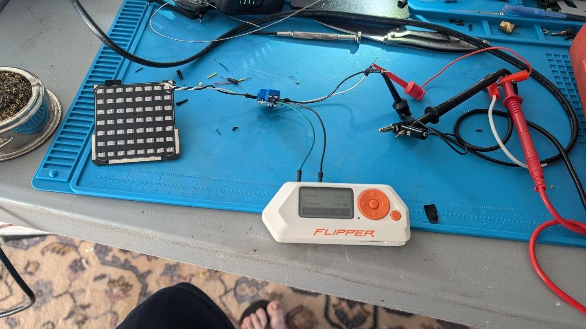

## Hackrf Portable Battery

- Source: Private source archive; public-safe derivative

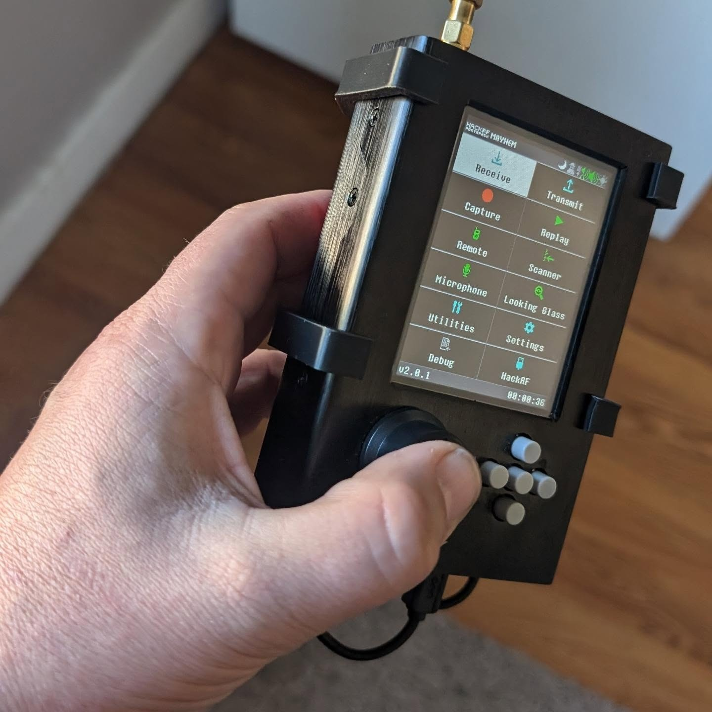 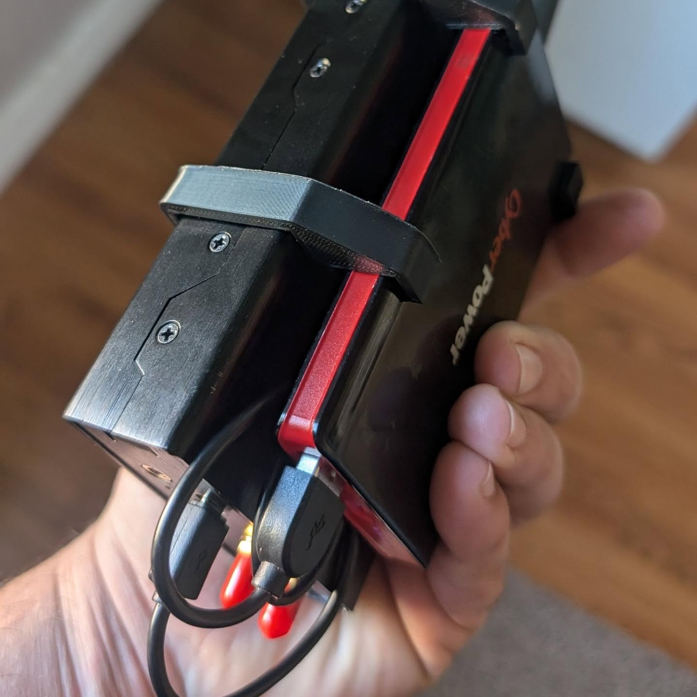
